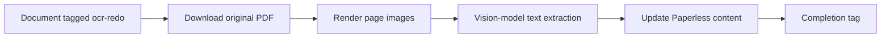

# paperless-ocr-enhanced

LLM vision-based OCR for [Paperless-ngx](https://github.com/paperless-ngx/paperless-ngx). Replaces Tesseract OCR with Google Gemini, GPT-4o, or Claude for dramatically better text extraction, especially on complex layouts, handwriting, and low-quality scans.

> **💡 Recommended:** Use **Gemini 2.0 Flash** (`gemini` provider) — it tops OCR accuracy benchmarks and is the cheapest option.

## Processing preview



*Tag a document in Paperless-ngx, let the service process its pages, and find the extracted text back in Paperless. The diagram shows that flow.*

[Read the project case study](https://blakemccarn.dev/work/paperless-ocr-enhanced)

## How it works

1. Polls Paperless-ngx for documents tagged with a trigger tag (default: `ocr-redo`)
2. Downloads the original PDF
3. Renders each page as a high-resolution image using PyMuPDF
4. Sends each page to an LLM vision API (OpenAI or Anthropic) for text extraction
5. Updates the document's content field in Paperless-ngx with the extracted text, making it fully searchable
6. Removes the trigger tag and adds a completion tag (default: `ocr-complete`)
7. On failure, adds an `ocr-failed` tag and moves on

## Quick Start

```yaml
# docker-compose.yml
services:
  paperless-ocr-enhanced:
    image: ghcr.io/merlin-helper/paperless-ocr-enhanced:latest
    environment:
      PAPERLESS_URL: "http://paperless-ngx:8000"
      PAPERLESS_TOKEN: "your-api-token"
      LLM_PROVIDER: "gemini"
      LLM_API_KEY: "your-google-ai-api-key"
    restart: unless-stopped
```

Then tag any document in Paperless-ngx with `ocr-redo` and it will be automatically re-OCR'd.

## Environment Variables

| Variable | Required | Default | Description |
|---|---|---|---|
| `PAPERLESS_URL` | ✅ | — | Paperless-ngx base URL |
| `PAPERLESS_TOKEN` | ✅ | — | Paperless-ngx API token |
| `LLM_API_KEY` | ✅ | — | OpenAI or Anthropic API key |
| `LLM_PROVIDER` | | `openai` | `openai`, `anthropic`, or `gemini` |
| `LLM_MODEL` | | *(per provider)* | Model name (defaults: `gpt-4o`, `claude-sonnet-4-20250514`, `gemini-2.0-flash`) |
| `TRIGGER_TAG` | | `ocr-redo` | Tag that triggers processing |
| `COMPLETE_TAG` | | `ocr-complete` | Tag added after success |
| `FAILED_TAG` | | `ocr-failed` | Tag added on failure |
| `POLL_INTERVAL` | | `30` | Seconds between polls |
| `OCR_PROMPT` | | *(built-in)* | Custom prompt for vision model |
| `LOG_LEVEL` | | `info` | `debug`, `info`, `warn`, `error` |
| `MAX_PAGES` | | `0` | Max pages per doc (0 = unlimited) |

## Getting a Paperless-ngx API Token

In Paperless-ngx, go to **Settings → API** or run:

```bash
docker exec -it paperless python manage.py get_api_token <username>
```

## Building

```bash
docker build -t paperless-ocr-enhanced .
```

## License

MIT
